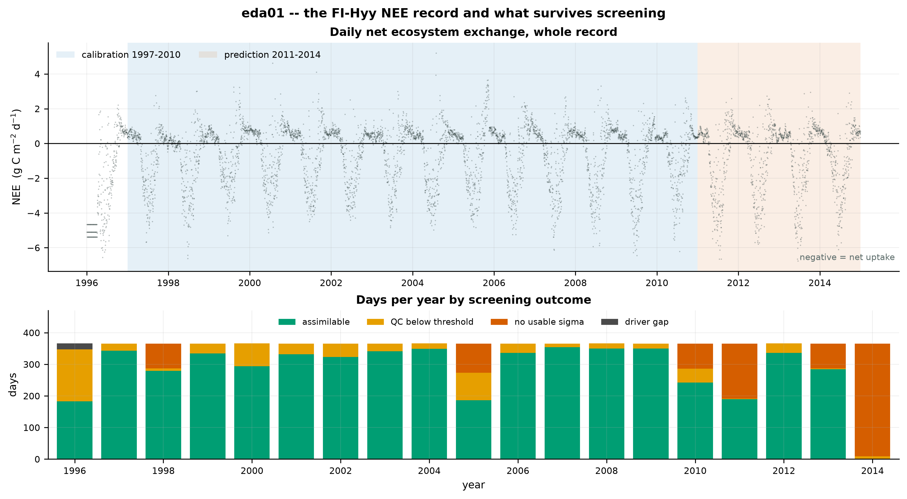
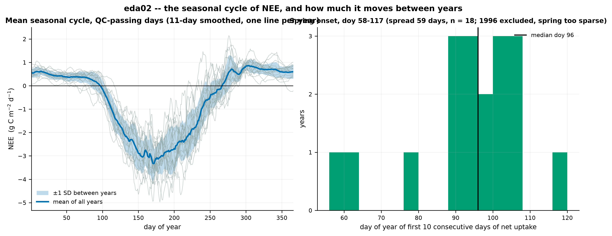
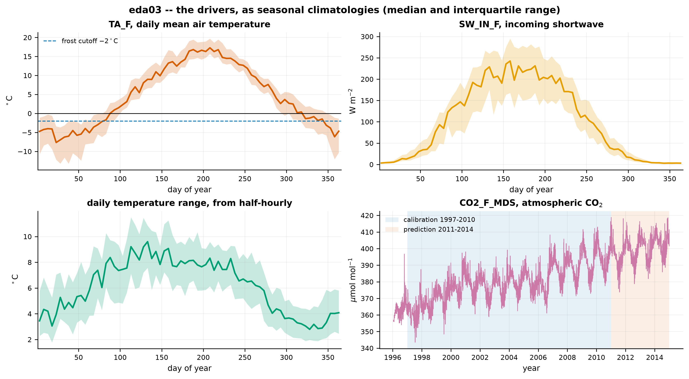
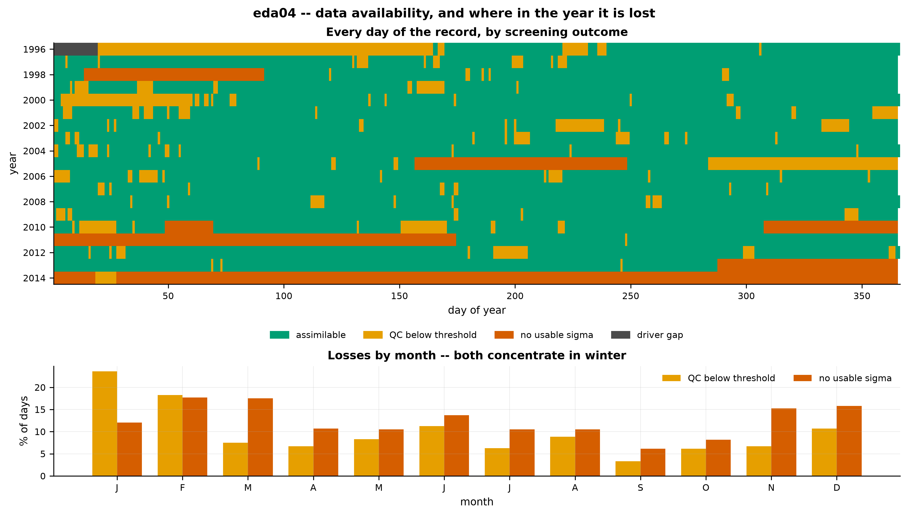
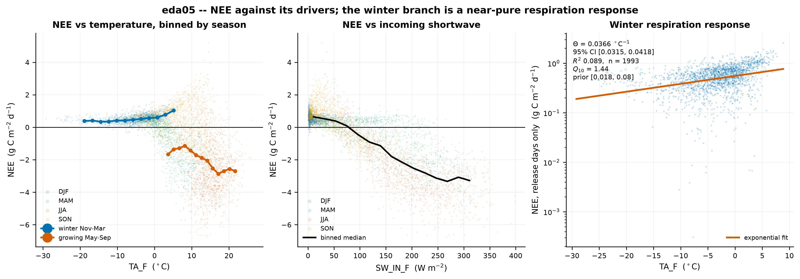

# Exploratory figures — FI-Hyy, what the data is

Five figures describing the record before anything is fitted to it. No model, no
PyTensor, no parameter. Reproduce with `python scripts/07_eda.py`.

Record: 6940 days, 1996–2014. Calibration 1997–2010, prediction 2011–2014.
Assimilable across the whole record: 5406 days.

---

## eda01 — the record and what survives screening

Daily NEE for the whole record with the two blocks shaded, and beneath it every
year broken down by screening outcome. The seasonal cycle is visible by eye and
consistent year to year; what varies is how much of each year survives.

Three years lose most of their data and each for a different reason: **1996** to
QC (183 of 366 days pass) plus the CO₂ driver gap, **2005** to a 92-day
mid-summer `RANDUNC` gap, and **2011 and 2014** to `RANDUNC` again. 2014 loses
every single day. The losses are blocks, not scatter.

## eda02 — the seasonal cycle, and how much it moves between years

Mean seasonal cycle over QC-passing days, one grey line per year, 11-day
smoothed. Uptake begins in April, peaks near −3.3 g C m⁻² d⁻¹ around day 170, and
the system returns to net release by early October. Between-year spread is
modest through the winter and widest at the summer minimum.

Spring onset — the first ten consecutive days of net uptake — has a median of
**doy 96** and runs **58 to 117**, a spread of two months. That spread is the
target any phenology parameterisation has to reproduce, and a fixed onset day
cannot.

**Screening on QC matters here and is not cosmetic.** Unscreened, 1996 drags the
onset estimate to doy 46. Its first **163 days — doy 1 to 163** — are at
QC = 0.0 throughout, filled with a repeating three-value cycle (−5.38, −4.66,
−5.11 g C m⁻² d⁻¹, each appearing 31 times) averaging −4.26 g C m⁻² d⁻¹. That
reads as five months of unbroken midwinter net uptake. It is fill, not flux; see
[LIMITATIONS.md](../../LIMITATIONS.md) §13. 1996 is
excluded from the onset panel outright: it has **zero** QC-passing days between
doy 60 and 150, so its apparent doy-166 onset is a coverage gap rather than a
late spring.

## eda03 — the drivers

Seasonal climatologies, median and interquartile range. Air temperature crosses
the −2 °C frost cutoff around doy 75 and again near doy 340, so the cutoff is
active for roughly a third of the year. Shortwave peaks near 240 W m⁻² and falls
to near zero in December. The true daily temperature range — derived from the
half-hourly product, not the day/night proxy — peaks near 9 °C in spring and
falls below 3 °C at midwinter. CO₂ is shown as a time series rather than a
climatology because its trend, roughly 360 to 400 µmol mol⁻¹ across the record,
dominates its seasonal cycle.

## eda04 — availability, and where in the year it is lost

Every day of the record by outcome, and the same losses aggregated by month.

**Yes — QC failures cluster seasonally, and they cluster in winter.** The
QC-below-threshold rate is **13.3% in winter (Nov–Mar) against 7.6% in the
growing season (May–Sep), a factor of 1.75**. January alone fails 23.6% of days
at a mean QC of 0.780, against September's 3.3% at 0.970. Missing `RANDUNC`
clusters the same way: 22–28% of January and February days against 6% in
September.

**But the interaction with the sigma weighting is not what it first looks like,
and it runs both ways.** Over the calibration block:

| | days in block | assimilable | kept | median σ | share of likelihood weight |
|---|---:|---:|---:|---:|---:|
| winter Nov–Mar | 2117 | 1691 | 79.9% | 0.063 | **78.8%** |
| shoulder Apr, Oct | 854 | 814 | 95.3% | 0.110 | 13.4% |
| growing May–Sep | 2142 | 1908 | 89.1% | 0.228 | 7.7% |

On totals, the QC clustering **offsets** rather than compounds: losing winter
days preferentially removes the most heavily weighted days, so winter's share of
the total likelihood weight is lower than it would otherwise be. The offset is
nowhere near enough to cancel the effect — winter is 38% of assimilable days and
**79% of the likelihood weight**, a net ratio of about 10:1 against the growing
season, 11.5× per surviving day.

On quality, it **does** compound, and this is the version worth carrying: the
days the likelihood leans on hardest are drawn from the season with the worst
data quality. Winter days survive QC ≥ 0.75, but the winter record is where
gap-filling is heaviest. The posterior will be most sensitive to the part of the
record that is least directly measured.

## eda05 — NEE against its drivers

Assimilable days only. Left: NEE against air temperature, scatter coloured by
season, with binned medians computed separately for winter and the growing
season. Centre: NEE against incoming shortwave. Right: the winter branch alone,
on a log axis.

The two temperature branches are opposite in sign and must not be pooled. In
winter NEE rises with temperature (+0.019 g C m⁻² d⁻¹ per °C) because respiration
is nearly all that is happening; in the growing season it falls (−0.097) because
photosynthesis dominates and responds to the light that accompanies warmth. A
single regression across all days would average these into near-nothing.

**The winter branch gives an empirical value for a model parameter.** With GPP
close to zero, NEE ≈ Reco, and DALEC makes decomposition proportional
to `exp(Θ·T)`. Regressing `ln(NEE)` on temperature over winter release days:

> **Θ = 0.0366 °C⁻¹**, 95% CI [0.0315, 0.0418], R² 0.089, n = 1993,
> implied Q₁₀ = **1.44**.
>
> DALEC's `temperature_exponent` prior is **[0.018, 0.08]** — the empirical value
> sits **inside** it, a little below centre.

That is a direct, pre-calibration check on a parameter the posterior will report,
and it passes. Two caveats attach to it. R² is 0.089: the slope is tightly
determined by 1993 days but temperature explains under a tenth of winter NEE
variance, so this constrains the *exponent*, not the whole winter budget. And
"winter respiration" is an approximation — an evergreen canopy fixes some carbon
on bright winter days, which biases the fitted slope, though the frost cutoff
covers the coldest part of that.

---

## Open questions from these figures

1. **Is the winter Θ estimate biased by residual winter photosynthesis?** The
   estimate assumes GPP ≈ 0 in Nov–Mar. Restricting to below-freezing days would
   test it, at the cost of sample size and range.
2. **Does the 10:1 seasonal weight ratio need addressing, or only reporting?**
   It follows from using `RANDUNC` as supplied, which is the locked decision, so
   the question is what it does to the posterior — a Task 3 question.
3. **Should the onset spread of 58–117 constrain the phenology priors?** The
   observed spread is wide enough that `d_onset` fixed at a single value is a
   strong assumption, and `d_fall` is inert as transcribed
   ([DECISIONS.md](../../DECISIONS.md) §2).
