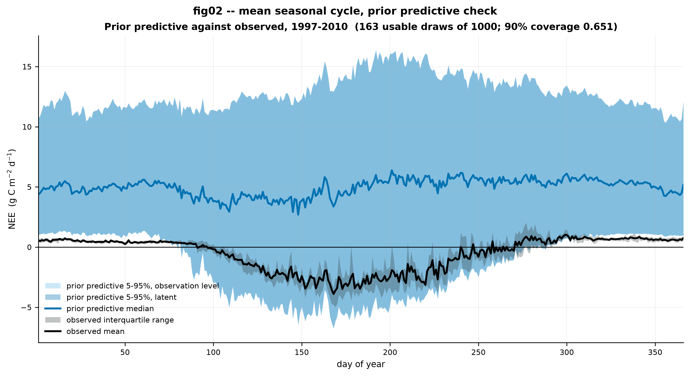

# Task 1 — prior predictive check

Reduced scope: `fig02_prior_pred_seasonal` and the coverage number, plus the A1
decade-mass requirement and the §1.5 failed-draw accounting. fig01, fig03 and
fig04 deliberately not built. **No prior was adjusted.**

Calibration block 1997–2010, 5113 days, 4413 assimilable. 1000 draws, master seed
20260809 from config. Prior draws taken from `PARAMETER_REGISTRY` with numpy per
amendment A2 — no PyMC model, and no bound retyped anywhere.

Reproduce with `python scripts/08_prior_predictive.py`.

---

## The check fails, and it fails in one specific place

| | |
|---|---:|
| **90% coverage** (observed days inside the observation-level band) | **0.651** |
| days inside | 2871 / 4413 |
| **failed draws** | **837 / 1000 (83.7%)** |
| failure mode | `|NEE| > 30` on at least one day, all 837 |
| usable draws behind the bands | 163 |

A well-specified prior gives roughly 0.90. At 0.651 the priors and the data
disagree, and the posterior will spend its effort fighting the prior rather than
being informed by it.

**And 0.651 flatters the prior.** It is computed from the 163 draws that
survived screening, as §1.5 requires. The unconditional prior — the thing NUTS
will actually explore — includes the 837 that produce daily fluxes above
30 g C m⁻² d⁻¹, against an observed record whose |NEE| never exceeds about 7.



**fig02.** Mean seasonal cycle over the calibration block. Observed day-of-year
mean in black with its interquartile range across years; prior predictive median
and 5–95% band over it, at both the latent and observation levels. Bands are
built from the 163 usable draws; 837 of 1000 were excluded as failures. The two
prior bands nearly coincide because `RANDUNC` has a median near 0.15 g C m⁻² d⁻¹,
negligible against a latent spread of roughly ±10.

The figure states the problem more plainly than the coverage number does. **The
prior predictive median is a net carbon source of about +5 g C m⁻² d⁻¹, all year
round.** The observed mean runs from +0.5 in winter to −3.3 at midsummer. The
prior does not merely have the wrong width — its central tendency has the wrong
sign for two-thirds of the year, and it carries almost no seasonal cycle where
the data has a large one.

---

## Why: a single product, and A1 is the mechanism

Comparing failed against surviving draws, one term separates them and the rest
barely move:

| parameter | median, failed | median, usable | ratio |
|---|---:|---:|---:|
| `theta_som` | 5.85e-4 | 1.02e-4 | **5.73** |
| `c_som_0` | 1.09e5 | 3.36e4 | **3.24** |
| `temperature_exponent` | 0.0524 | 0.0369 | 1.42 |
| `theta_woo` | 5.32e-4 | 4.37e-4 | 1.22 |
| `lma` | 205 | 177 | 1.16 |
| `f_auto` | 0.507 | 0.463 | 1.10 |
| `theta_lit` | 4.85e-3 | 4.69e-3 | 1.03 |
| `theta_roo` | 5.03e-3 | 4.85e-3 | 1.04 |

Heterotrophic respiration is `(theta_lit·C_lit + theta_som·C_som)·exp(Θ·T)`. Its
two terms behave completely differently:

| term, at T = 0 °C | median | 95th pct | failed median | usable median |
|---|---:|---:|---:|---:|
| `theta_lit × c_lit_0` (litter) | 3.48 | 13.91 | 3.46 | 3.69 |
| **`theta_som × c_som_0` (soil)** | **37.89** | **143.15** | **48.01** | **3.75** |

Litter is identical between failed and usable draws. **Soil respiration is the
entire story**: 12.8× apart, with a prior median of 37.9 g C m⁻² d⁻¹ before the
temperature multiplier is applied at all. **63.2% of draws imply combined
heterotrophic respiration above 30 g C m⁻² d⁻¹**, against a site whose total net
flux never exceeds about 7.

This is exactly the A1 finding, arriving as a consequence rather than a
curiosity. Both factors are uniform over wide ranges with their mass at the top:

```
theta_som   [1e-7, 1e-3]   4.00 orders   90.0% of mass in the top decade
theta_min   [1e-5, 1e-2]   3.00 orders   90.1%
c_woo_0     [100, 1e5]     3.00 orders   90.1%
c_som_0     [100, 2e5]     3.30 orders   50.0% above 1e5, 95% above 1e4
d_onset     [1, 365]       2.56 orders   72.8% in [100, 365)
d_fall      [1, 365]       2.56 orders   72.8% in [100, 365)
```

A uniform prior on `theta_som` places **99% of its mass above 1e-5** — four
decades of range and essentially none of the probability in the bottom two. That
is a strong substantive claim about soil turnover, not an expression of
ignorance. Multiply two such priors together and the product concentrates an
order of magnitude above anything the site does.

`d_onset` and `d_fall` meet the >2-orders rule mechanically, but decade mass is
not a meaningful reading for a calendar day; they are listed for completeness
only.

---

## What this costs, and what it is evidence for

§1.5 asks for the failure rate as a result in its own right, and here it is:
**83.7% of prior draws produce trajectories that no ecosystem could exhibit.**
Ecological Dynamical Constraints exist precisely to reject these before they
reach a sampler. This project drops EDCs deliberately — hard accept/reject
breaks gradient-based sampling, so constraints go in by reparameterisation
instead ([DECISIONS.md](../../DECISIONS.md) §1).

83.7% is therefore the **measured cost of that methodological choice**, and it is
the empirical support for describing it as a real trade rather than a free one.
It also sets an expectation for sampling: NUTS will begin in a region where five
draws in six are physically absurd, which bears directly on initialisation,
divergences and tuning length.

Offending parameter vectors: [`failed_draws.csv`](failed_draws.csv), 837 rows
with the failure reason attached. Decade masses: [`prior_decade_mass.csv`](prior_decade_mass.csv).

---

## Recommendations — proposed, not applied

Per §7 no prior has been touched. A prior tuned to fit the data it is about to be
updated with is no longer a prior, and the mismatch above is the finding. These
are for supervision:

1. **The binding problem is the joint prior on `(theta_som, c_som_0)`, not
   either marginal.** Anything that fixes one alone will leave the product wrong.
   The three routes worth weighing are: log-uniform priors on both, which moves
   mass down by orders and is a change to the locked bounded-uniform decision;
   reparameterising to sample the soil respiration flux at a reference
   temperature directly, with the pool/rate split as a weakly-identified
   secondary; or narrowing `c_som_0` to a measured boreal podzol range, which
   requires a citation this project does not yet have.
2. **`theta_min` and `c_woo_0` have the same shape of problem** — 90% of mass in
   the top decade — and have not yet bitten only because neither enters
   respiration directly. `theta_min` is a transfer, not a loss.
3. **One encouraging cross-check.** The `temperature_exponent` median among
   usable draws is 0.0369, against the empirical winter value of
   0.0366 °C⁻¹ measured independently in
   [EDA_NOTES.md](EDA_NOTES.md) eda05. The failed draws sit at 0.0524. The
   physically plausible region of this prior is where the data already points.

## Open questions

1. **Does the coverage number mean much at 163 usable draws?** The 5–95% band is
   estimated from 163 samples, so its tails are noisy. Re-running at more draws
   would tighten it, at roughly 15 minutes per 1000.
2. **Should coverage be reported conditionally or unconditionally?** Reported
   here after excluding failures, per §1.5. The unconditional number is worse and
   is arguably the more honest description of what the sampler faces.
3. **Nothing here tests the Gaussian likelihood assumption**, only the scale
   parameter's consequences. See [LIMITATIONS.md](../../LIMITATIONS.md) §8.
