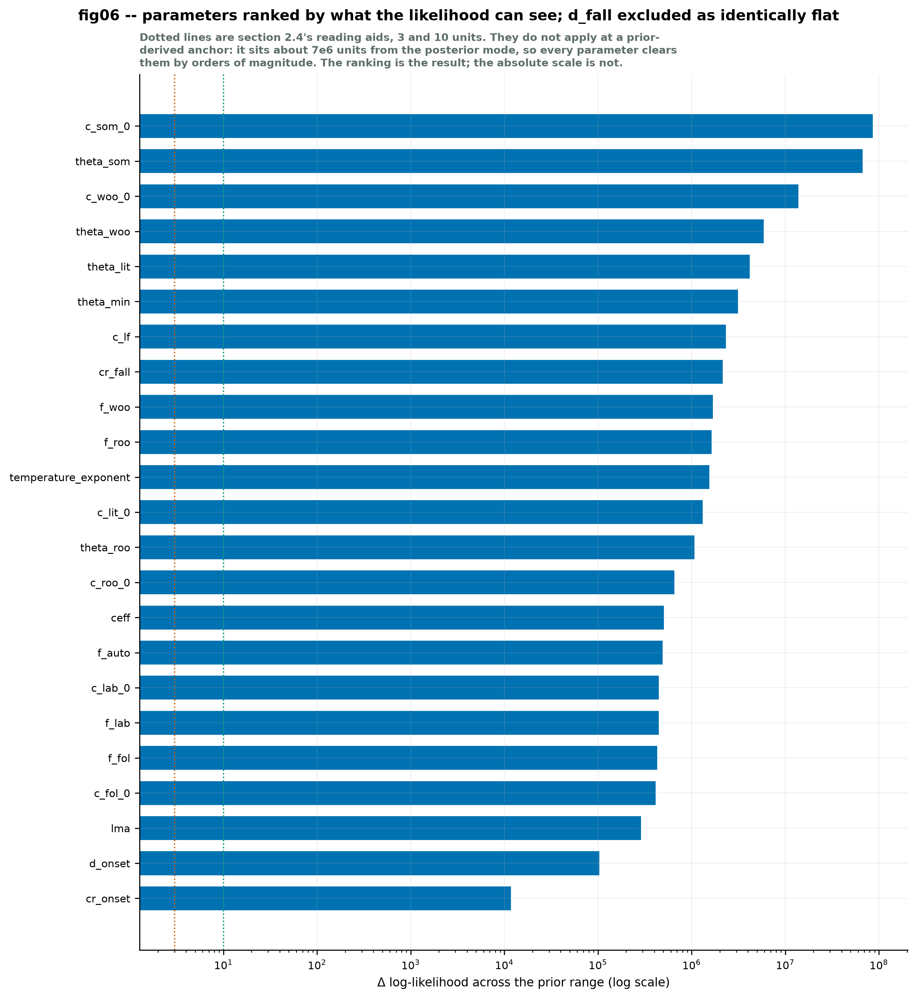
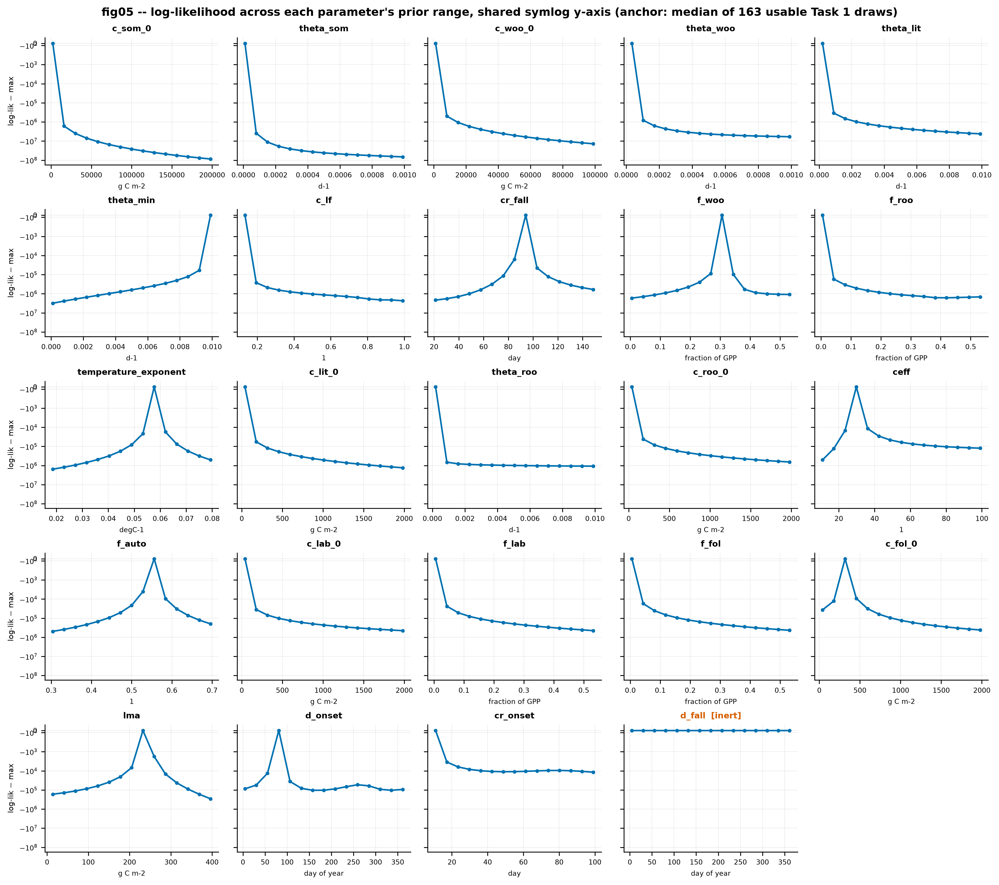

# Task 2 — one-at-a-time sensitivity

Reduced scope: `fig05_oaat_loglik_panels` and `fig06_oaat_ranking`. No fig07, no
`grad_scaled` (amendment A3 dropped from this scope), **no prior changed**.

Calibration block 1997–2010, 5113 days, 4413 assimilable. 24 parameters × 15
sweep points, 1st to 99th prior percentile, linear spacing because the priors are
uniform (A1).

Reproduce with `python scripts/09_sensitivity_oaat.py`; `--figures-only` rebuilds
the figures from the cached sweeps in `results/prior_diagnostics/cache/`.

---

## The anchor, and why it is not the prior median

Every sweep holds the other parameters at the **component-wise median of the 163
draws that survived Task 1's screening**. That set is recoverable exactly — Task 1
is deterministic from the master seed and wrote out which draws failed — so the
anchor costs no extra forward runs.

The correction matters more than "a better centre". Evaluated side by side:

| anchor | log-likelihood | annual NEE | RMSE | §1.5 screen |
|---|---:|---:|---:|---|
| **usable-draw median** (used) | −6,913,804 | +1408.4 | 4.655 | **passes** |
| prior median (rejected) | −191,694,127 | +9692.7 | 34.998 | **fails, `\|NEE\| > 30`** |

**The prior median is not merely a worse anchor — it is a point the model's own
screen rejects.** It produces daily fluxes above 30 g C m⁻² d⁻¹ and an RMSE of
35.0 against a record whose total net flux never exceeds about 7. Sweeping around
it would have measured sensitivity in a region the posterior can never visit, and
84% of prior draws cannot reach either.

The difference is almost entirely the soil term Task 1 identified. Heterotrophic
respiration at T = 0:

| | soil `theta_som × c_som_0` | litter `theta_lit × c_lit_0` | combined |
|---|---:|---:|---:|
| prior median | 50.03 | 5.10 | **55.13** |
| usable-draw median | 3.43 | 5.44 | **8.87** |

Only two parameters shift materially between the anchors — `theta_som` to 0.20×
and `c_som_0` to 0.34×. Everything else moves by 0.85–1.15×.

---

## The ranking

**fig06.** Parameters ordered by `d_loglik`, the range of the Gaussian
log-likelihood across each parameter's prior range, on assimilable days with
`RANDUNC` as σ. `d_fall` is excluded — see below.

| rank | parameter | `d_loglik` | `d_nee_annual` | `d_rmse` |
|---:|---|---:|---:|---:|
| 1 | `c_som_0` | 86,292,289 | 6,677.1 | 18.456 |
| 2 | `theta_som` | 66,893,102 | 5,493.4 | 15.230 |
| 3 | `c_woo_0` | 13,817,657 | 2,153.4 | 5.806 |
| 4 | `theta_woo` | 5,904,302 | 1,158.3 | 2.930 |
| 5 | `theta_lit` | 4,171,863 | 609.5 | 1.477 |
| 6 | `theta_min` | 3,127,217 | 632.8 | 1.703 |
| 7 | `c_lf` | 2,327,074 | 1,163.6 | 3.501 |
| 8 | `cr_fall` | 2,152,030 | 39.7 | 0.163 |
| 9 | `f_woo` | 1,689,887 | 700.5 | 2.546 |
| 10 | `f_roo` | 1,630,602 | 888.6 | 2.903 |
| 11 | `temperature_exponent` | 1,549,862 | 943.0 | 3.672 |
| 12 | `c_lit_0` | 1,311,552 | 98.5 | 0.282 |
| 13 | `theta_roo` | 1,076,266 | 165.0 | 0.421 |
| 14 | `c_roo_0` | 653,285 | 97.5 | 0.234 |
| 15 | `ceff` | 506,112 | 733.1 | 2.372 |
| 16 | `f_auto` | 489,067 | 803.7 | 2.001 |
| 17 | `c_lab_0` | 448,359 | 75.1 | 0.197 |
| 18 | `f_lab` | 447,244 | 75.2 | 0.204 |
| 19 | `f_fol` | 429,717 | 63.6 | 0.249 |
| 20 | `c_fol_0` | 413,600 | 73.8 | 0.183 |
| 21 | `lma` | 288,310 | 569.5 | 1.604 |
| 22 | `d_onset` | 103,896 | 52.1 | 0.132 |
| 23 | `cr_onset` | 11,753 | 21.7 | 0.054 |

**The soil pair leads by an order of magnitude over anything else**, and the top
four are all slow-pool quantities: soil and wood size and turnover. That is the
same structure Task 1 found, arrived at by a different route.

**`d_nee_annual` and `d_loglik` disagree, which §2.2 anticipated.** `cr_fall`
ranks 8th on likelihood but moves annual NEE by only 39.7 g C m⁻² yr⁻¹, while
`lma` ranks 21st yet moves it by 569.5. A parameter can shift the ecosystem
substantially and still be nearly invisible to the likelihood if it shifts it on
days where σ is large — the reason `d_loglik` is the ranking statistic and ΔNEE
is reported beside it rather than instead.

### The absolute numbers do not mean what §2.4's thresholds assume

§2.4 offers 2–3 units as "the data cannot distinguish the ends" and 10 as "expect
visible contraction". **Those cannot be applied here and the figure says so.**
They presuppose an anchor near the posterior mode. This anchor sits about
7 × 10⁶ log-likelihood units away from it: σ is around 0.1 g C m⁻² d⁻¹, the
anchor's residuals are around 4.7, so each assimilable day contributes on the
order of 10³ and there are 4413 of them. Every parameter clears 10 by four orders
of magnitude, which says nothing about any of them.

**The ranking is the result. The absolute scale is not.** Rules of thumb of this
kind will only become usable once there is a fitted point to anchor on.

---

## The shape of each response

**fig05.** Log-likelihood relative to its own maximum across each parameter's
prior range, shared **symlog** y-axis. The specification asks for a shared axis
"so flatness is comparable by eye"; on a shared *linear* axis `c_som_0` and
`theta_som` span 9 × 10⁷ units and all 21 other panels render as flat lines,
hiding variation of 10⁵–10⁶. Symlog keeps one axis across all panels and leaves
that variation visible. `d_fall` is shown, marked inert, but not ranked.

Two shapes appear, and the distinction is more useful than the ranking alone.

**Pushed to a boundary.** `c_som_0`, `theta_som`, `c_woo_0`, `theta_woo`,
`theta_lit`, `c_lf`, `c_lit_0`, `theta_roo`, `c_roo_0`, `c_lab_0`, `f_lab`,
`f_fol`, `f_roo` and `cr_onset` all fall monotonically from the low end: the
likelihood wants the smallest value the prior allows. `theta_min` is the mirror
image, rising monotonically to its upper bound — consistent with its being a
*transfer* out of litter rather than a loss, so raising it moves carbon into the
slower-respiring soil pool. **A monotone response to a bound is a prior-range
finding, not a parameter estimate:** it says the plausible value lies at or
outside the published range, which is exactly what Task 1's decade-mass result
predicted for the soil terms.

**Interior optimum.** `cr_fall` (≈95 d), `f_woo` (≈0.30), `temperature_exponent`
(≈0.058), `ceff` (≈30), `f_auto` (≈0.55), `c_fol_0` (≈330 g C m⁻²), `lma`
(≈230 g C m⁻²) and `d_onset` (≈85) each peak inside their range. These are the
parameters for which this diagnostic offers a genuine indication of location.

Two of those land near independent estimates, which is worth noting without
over-reading: `d_onset` at ≈85 against an observed spring-onset median of doy 96
([EDA_NOTES.md](EDA_NOTES.md) eda02), and `ceff` at ≈30 against the Loobos
published equivalent of 29.6 ([DECISIONS.md](../../DECISIONS.md) §3). Both are
conditional optima given every other parameter at the anchor, so agreement is
suggestive rather than confirmatory.

One tension: `temperature_exponent` peaks at ≈0.058, against the empirical winter
value of 0.0366 °C⁻¹ measured directly from the flux record (eda05) and a
usable-draw median of 0.0369. The OAAT optimum is conditional on a soil pool that
is itself far from fitted, so the disagreement is not yet evidence against either
number — but it is worth revisiting once the posterior exists.

---

## `d_fall` — excluded, and why that is not a finding about the data

Per amendment A6, `d_fall` has `d_loglik` of **exactly zero** and is excluded from
the ranking rather than reported as an unconstrained parameter.

It is **inert as transcribed**: the A8 sine argument is written `doy - cr_fall +
psi_f`, so `d_fall` is accepted, carries a 1–365 prior, and has no effect
whatsoever on the forward model ([DECISIONS.md](../../DECISIONS.md) §2,
correction 2). Its flat panel is a property of the transcription, not a statement
about what NEE can constrain, and reporting it as "the data cannot see `d_fall`"
would misattribute a code decision to the observations.

The exclusion is implemented generically — any parameter whose profile is
identically flat is dropped and listed — rather than by naming `d_fall`, so a
second inert parameter could not slip through silently. `d_fall` is currently the
only one.

---

## The limitation of one-at-a-time sweeps

Stated plainly, per §2.4, because it bounds everything above.

One-at-a-time sweeps hold every other parameter fixed at a single point. They
therefore **cannot detect constraint that exists only in combination**, and they
**cannot detect trade-offs where two parameters are jointly identified but
individually flat**. A parameter that looks flat here may be perfectly well
determined in concert with another; a parameter that looks influential here may
owe its influence entirely to the particular values the others were held at.

This is a screening tool that predicts which posteriors will resemble their
priors. **It is not a proof of non-identifiability.** The synthetic twin
experiment and the posterior itself are what settle that.

The point bites harder than usual here for two reasons. The anchor is a prior
summary rather than a fitted point, so "the values the others were held at" are
themselves far from where the posterior will sit. And Task 1 showed the dominant
structure is a *product*, `theta_som × c_som_0` — precisely the kind of joint
behaviour a one-at-a-time design is blind to. Both parameters rank 1st and 2nd
here individually, but that ranking cannot tell you the data may constrain only
their product.

---

## Open questions

1. **Does the boundary behaviour survive a joint sweep?** Fourteen parameters run
   to a bound one-at-a-time. Whether that persists when the soil pair moves
   together is exactly what this design cannot answer, and is the argument for
   Morris screening ([LIMITATIONS.md](../../LIMITATIONS.md), A11 deferral).
2. **Should the interior optima inform starting values for sampling?** They are
   conditional, but NUTS initialisation from a region 7 × 10⁶ log-likelihood units
   from the mode is its own risk.
3. **Is `temperature_exponent` ≈ 0.058 or ≈ 0.037?** The OAAT optimum and the
   direct empirical estimate disagree by more than the empirical 95% CI
   [0.0315, 0.0418]. Resolvable only once the soil terms are constrained.
4. **`d_fall` remains inert.** Until the A8 anchor question is settled with the
   authors, one sampled parameter cannot affect the likelihood at all and will
   return its prior.
