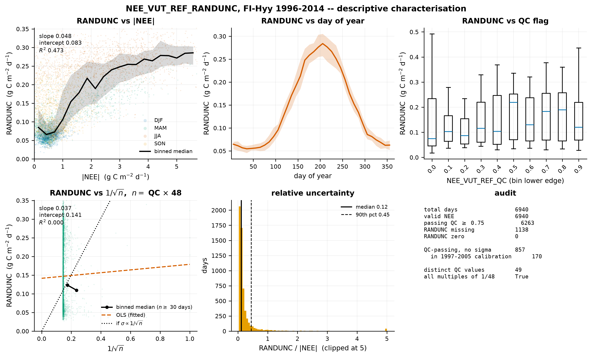

# Task 4 — What is `NEE_VUT_REF_RANDUNC`?

Pre-sampling diagnostics, FI-Hyy. Purely descriptive: no model is involved and no
posterior is sampled.

`RANDUNC` supplies the per-day standard deviation of the Gaussian likelihood, so
what it actually represents decides what the likelihood actually asserts. This
task audits the column and characterises its behaviour.

Reproduce with `python scripts/06_randunc_characterisation.py`.
Standalone by design (amendment A10); merges into the combined `FINDINGS.md`
when Tasks 1–3 land.

---

## The short version

**`RANDUNC` is not the standard error of a daily mean.** The test that would
confirm that reading fails decisively: `log(RANDUNC)` regressed on `log(n)` gives
a slope of **−0.012**, where −0.5 is required. It behaves instead as a
**magnitude-proportional uncertainty** — it tracks the size of the flux
(R² = 0.47, r = +0.69), not how much of the day was measured.

**857 days pass QC but cannot enter the likelihood** because they have no usable
sigma — **170 of them inside the 1997–2005 calibration block**. The rule for
handling them is already decided and encoded; it is recorded below rather than
re-opened.

---

## 1. Data audit

FLUXNET2015 FULLSET DD, FI-Hyy, 1996-01-01 to 2014-12-31. The `-9999` sentinel is
converted to NaN on load by `dalec.data_io.load_fluxnet_dd` before any statistic
is computed.

| | days |
|---|---:|
| total days in record | 6940 |
| days with valid `NEE_VUT_REF` | 6940 |
| days passing `NEE_VUT_REF_QC` ≥ 0.75 | 6263 |
| valid NEE but `RANDUNC` **missing** | 1138 |
| valid NEE but `RANDUNC` **zero** | 0 |
| **QC-passing days with no usable sigma** | **857** |
| — of which inside calibration 1997–2005 | **170** |

Every day in the record carries a NEE value: the VUT_REF product is gap-filled
throughout, and `QC` rather than absence is what marks quality. `RANDUNC` is the
column with real gaps.

`RANDUNC` is **never zero** in this record, only missing. The distinction matters
because the two would assert different things — a missing value is an absent
estimate, a zero would be a claim of perfect measurement — so the zero branch is
retained as a guard in code even though it never fires here.

### Contiguous blocks with no usable sigma

Six blocks account for all 857 days. They are blocks, not scattered days, which
matters: the loss is concentrated in whole seasons rather than spread thinly.

| start | end | days |
|---|---|---:|
| 2014-01-28 | 2014-12-31 | 338 |
| 2010-11-04 | 2011-06-23 | 232 |
| 2013-10-15 | 2014-01-18 | 96 |
| 2005-06-06 | 2005-09-05 | 92 |
| 1998-01-14 | 1998-04-01 | 78 |
| 2010-02-18 | 2010-03-10 | 21 |

Only two touch the calibration block: 2005-06-06 to 2005-09-05 (92 days, an
entire growing season) and 1998-01-14 to 1998-04-01 (78 days, a late winter and
spring). The 2005 block is the more costly of the two — it removes the part of
the year that carries the most information about photosynthesis.

This is consistent with the year-block choice already recorded in
`config/default.yaml`: 2014 was excluded from both blocks precisely because it
has no `RANDUNC` at all.

### The rule for those days is already decided

Not an open question. `dalec.data_io._likelihood_mask` requires

```python
np.isfinite(nee) & np.isfinite(qc) & (qc >= qc_threshold)
& np.isfinite(unc) & (unc > 0.0)
```

so days without a usable sigma are **dropped from the likelihood, not imputed**,
and `SiteData.nee_mask` carries the result. They are *not* dropped from the time
series — the forward model still integrates through them, because the carbon
pools evolve whether or not anyone measured that day.

Imputing sigma from a binned median was the alternative. It was not taken: an
imputed sigma would assign a confident weight to a day whose uncertainty is
unknown, and on a 92-day contiguous growing-season block that would be inventing
information at exactly the point where the record is weakest.

### On dates versus indices

The concern that time might be tracked positionally is already answered
architecturally, and is worth being able to point to: `build_site_data` never
drops rows, `SiteData.time` is a real `datetime64` array, and QC screening
produces a boolean mask applied at the likelihood rather than by deletion. There
is no code path in which a row number stands in for a date.

---

## 2. What `RANDUNC` behaves like



**Figure 11.** `NEE_VUT_REF_RANDUNC` at FI-Hyy, 1996–2014, all days with a usable
NEE and a usable sigma (n = 5802; n = 5677 where `QC > 0`). Panel 1: `RANDUNC`
against `|NEE|`, coloured by meteorological season, with binned medians and
interquartile range. Panel 2: seasonal cycle of `RANDUNC`. Panel 3: distribution
by QC decile. Panel 4: `RANDUNC` against `1/√n` with `n = QC × 48` — **`QC` takes
exactly 49 distinct values, all multiples of 1/48, so this is an exact count of
contributing half-hours, not an approximation.** The dotted line shows what a
standard error of a daily mean would look like; the data do not follow it. Panel
5: relative uncertainty. Panel 6: the audit counts.

### Panel 4 — the panel that was meant to settle it, and does

| statistic | value | expected if `RANDUNC` were the SE of a daily mean |
|---|---:|---|
| OLS `RANDUNC` on `1/√n` — R² | **0.0002** | near 1 |
| **log-log slope, log(`RANDUNC`) on log(n)** | **−0.012** | **−0.500** |
| partial r with `1/√n`, controlling for `|NEE|` | **−0.012** | strongly positive |
| Pearson r | +0.015 | strongly positive |
| Spearman r | +0.130 | strongly positive |

The log-log slope is the statistic to quote: it is independent of how the panel
is binned, and it is essentially zero against a required −0.5. Binned medians of
`RANDUNC` against `n` confirm it directly — 0.087 at n = 8–16, rising to 0.190 at
n = 36–47, then falling to 0.115 at n = 47–48. Not only is there no decline with
`n`, the trend is non-monotonic, and it tracks median `|NEE|` in the same bins
(0.64, 1.44, 0.78) rather than `n`.

**So `RANDUNC` is not an estimate of the standard error of a daily mean, and it
is not a measure of how much of the day was measured.**

*Power caveat.* 73.5% of days sit at exactly `QC = 1`, so leverage on the `n`
dependence comes from a minority of days. But the test is not merely
underpowered: across the range where `n` does vary, the relationship has the
wrong shape and no consistent sign, and the partial correlation is zero after
`|NEE|` is removed.

### Panel 1 — what it does track

`RANDUNC` scales with the magnitude of the flux: OLS slope **0.048**, intercept
**0.083** g C m⁻² d⁻¹, **R² = 0.473**, Pearson r = +0.69. The shape is a floor
plus a rising term — the signature of a multiplicative error model with an
additive noise floor.

**The linear fit is a summary, not a law.** The binned median is visibly concave:
it dips to about 0.065 near `|NEE|` = 0.5 before rising, so the OLS line
over-predicts at low flux (0.130 against an observed median of 0.107 for `|NEE|`
between 0.9 and 1.1). Quote the slope and R² as a characterisation of the error
structure; do not use the fitted line to predict a sigma — and see §4 for why it
must not be used in the likelihood at all.

### Panel 2 — a seasonal cycle, driven by the same thing

`RANDUNC` runs from 0.055 g C m⁻² d⁻¹ in midwinter to 0.284 in midsummer, a
factor of 5.2, peaking at day 206. That peak sits close to the peak of
`|NEE|`, so this panel is largely panel 1 seen through the seasonal cycle of flux
magnitude rather than independent evidence of a seasonal error structure.

**This has a direct consequence for the likelihood.** Summer days are
down-weighted by roughly 1/0.285² against winter days at 1/0.055² — a factor of
**27.0** in likelihood weight per day. Winter is where the likelihood has its
leverage, which is the empirical support for treating winter as the
respiration-information window, and it will matter to Task 3.

### Panel 3 — QC does not explain it

`RANDUNC` does not fall systematically as `QC` rises. Medians by QC decile run
0.075, 0.103, 0.087, 0.116, 0.103, 0.219, 0.130, 0.183, 0.190, 0.120 — no
monotone trend, and the highest-QC decile is not the lowest-sigma one. If `RANDUNC` were tracking how much of the day was actually
measured, this panel would slope down. It does not, which is the same conclusion
as panel 4 by a different route.

### Panel 5 — relative scale

`RANDUNC / |NEE|` has median **0.116** and 90th percentile **0.450**. So a
typical day carries about 12% relative uncertainty, but the upper decile exceeds
45% — those being low-flux days, where the additive floor dominates the
proportional term.

---

## 3. Plain statement

`RANDUNC` behaves as an **uncertainty that grows with flux magnitude on top of an
additive floor** — OLS `0.083 + 0.048·|NEE|` g C m⁻² d⁻¹ as a summary, though
the true relationship is concave rather than linear. It does not
behave as the standard error of a daily mean over the measured half-hours, and it
carries no detectable dependence on how much of the day was measured once flux
magnitude is accounted for.

For the likelihood, the practical consequences are:

1. Using per-day `RANDUNC` rather than a constant sigma is **empirically
   justified** — sigma genuinely varies by a factor of five through the year.
2. That variation is **not random across the record**: it is structured by
   season, so it systematically re-weights which part of the year the posterior
   listens to. Summer days carry roughly 1/27 the weight of winter days.
3. `RANDUNC` is a **random-error term only**. It does not include structural
   model error, so the likelihood as specified asserts that the forward model is
   correct up to this random component — which the known structural problems in
   `LIMITATIONS.md` say it is not.

---

## 4. The circularity caveat

**The regression in panel 1 is descriptive only.** It must not be turned into a
likelihood.

Fitting `σ = a + b·|NEE|` and substituting the fitted function into the Gaussian
would make each observation's weight a function of that same observation. That is
circular: days that happen to have a large measured `|NEE|` would be
down-weighted *because* they are large, which biases the posterior toward
parameter sets that predict large fluxes on exactly those days, and shrinks the
apparent uncertainty in a way that has no basis in the measurement.

`RANDUNC` is used **as supplied, per observation**. The regression exists solely
to characterise the error structure and to provide the empirical justification
for a time-varying `σ_t` over a constant `σ`.

---

## 5. Open questions

1. **What does the ONEFlux pipeline actually compute for `RANDUNC`?** The
   evidence here rules out the standard error of a daily mean and points to a
   magnitude-proportional construction, but the definitive answer is in the
   ONEFlux documentation (Pastorello et al. 2020) and has not been checked
   against the source. This should be verified before the reading in §3 is
   asserted in the thesis.
2. **Does the additive floor of 0.083 g C m⁻² d⁻¹ have a physical
   interpretation**, or is it an artefact of the gap-filling? It sets the sigma
   on low-flux winter days, which is where the likelihood has most of its weight,
   so it is not a minor detail.
3. **The seasonal re-weighting is a design consequence that has not been
   examined.** A factor of 27 between summer and winter days is large. Whether it
   is desirable is a separate question from whether it is correct, and Task 3's
   σ-weighted sensitivity profiles are what will make it concrete.
4. **The two calibration-block gaps are not equivalent.** Losing 92 days of the
   2005 growing season is a different kind of loss from 78 days of 1998 winter,
   and neither the year-block choice nor the QC threshold was set with that
   asymmetry in view.
5. **Non-Gaussian flux errors** are documented in the literature
   (`LIMITATIONS.md` §8) and are out of scope here. Nothing in this task tests
   the Gaussian assumption itself — only the scale parameter.
